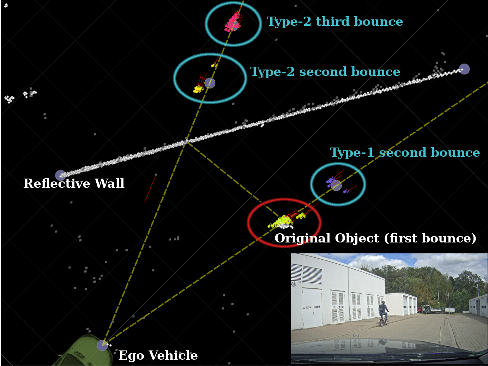

# Label Convention


Description of the labels. Main focus of the labeling convention is to encode different multi-path reflections (e.g. type1 second order, ...). Check the paper for more details.

Make sure to check the [Examples](#examples) and [Work with Labels](#work-with-labels) Section to get a better feel for the labeling scheme.


The labels are provided in the `label_id` field of the radar data. The `label_id` is encoded as an integer. Special values are reserved for "background", "ignore" and "noise".


## Special Values
| Integer Representation | Human Readable | Description |
| ---------------------- | ----------- | ----------- |
| 0      | background | All detections which don't have a specific label assigned during the annotation process are considered background. |
| -1                 | ignore | Ignore regions or detections impossible to correctly annotate. E.g. moving truck in background. |
| -2                 | noise | Radar artifacts |

## Groups
There is also the `group` column which is a boolean value indicating whether an annotation belongs to a group of things. This is only used for pedestrians in one scenario.

## 4 Digit Labels
All other annotations are represented by an 4 digit integer, with an optional minus sign (sketchy).

The 4 digit integer splits into 4 parts C, M, T, and O:
```
CMTO - (class, is_main, type, order)
```

Overview table for CMTO:
| Digit  | Possible Value | Meaning |
| ------ |  ------- | ------- |
| C | 1 - 5 | **class** - The first digit c encodes the class. (E.g. pedestrian, cyclist) |
| M | 1 or 0 | **is_main** - Whether it is the main object (1) or another object (0). |
| T | 3-bit binary number xxx -> 0 - 8 | **type** - Bounce type (1st, 2nd, or undecided) |
| O | 3-bit binary number xxx -> 0 - 8 | **order** - Bounce order (1st/real, 2nd, 3rd, or undecided) |

### Class Mapping (C)
The class (C) part indicates the class of the annotation.

Class ID (C) | Class Name
------------ | ----------
1            | pedestrian (ped)
2            | cyclist (cycl)
3            | car
4            | large_vehicle
5            | motorcycle

Python mapping
```python
class2str = {
    1: 'pedestrian',
    2: 'cyclist',
    3: 'car',
    4: 'large_vehicle',
    5: 'motorcycle',
}
```

### Main Object (M)
The is_main (M) part indicates whether it is the main or another object.

For more information about the main object check the original paper. In short each sequence has a main object which moves in front of a reflective surface. For this object detailed multi-path annotations are present. For all other objects only rudimentary multi-path annotations are present.


Main (M) | Description
-------- | ----------
1        | Annotation refers to main object
0        | Annotation refers to another object


### Bounce Type (T)
For the bounce type we differentiate between type1 and type2 bounces. Type1 bounces are those where the signal is returned from the real object. Type2 bounces are those where the signal is returned from a reflective surface. We encode this with a binary system.

Bounce Type | Binary | Decimal (T) | Description
----------- | ------ | ----------- | -----------
type 1      | 001    | 1           | type 1 multi-path detection
type 2      | 010    | 2           | type 2 multi-path detection
type 1 or 2 | 011    | 3           | type1 or/and type2 multi-path detection. Whenever both types are possible. Happens mostly for second order bounces when the object is on the orthogonal line between mirror and radar sensor.
undecided   | 000    | 0           | If unclear where the last bounce occurred. Or for all "random" multi-path reflections. This is also used for multi-path reflections caused by other objects (not main object).

### Bounce Order (O)

For the bounce order we differentiate between first (or real object), second, and third order. The order represents the number of bounces the signal took before returning to the sensor. Everything above 3 bounces is no longer easy to label since the geometry becomes too complex if multiple reflective surfaces are involved.


Bounce Order | Binary | Decimal (T) | Description
------------ | ------ | ----------- | -----------
1st/real     | 001    | 1           | Real or normal detection. Signal returned directly from object of interest to the sensor.
2nd          | 010    | 2           | Signal took an additional bounce (last bounce either on real object or on reflective surface)
3rd          | 100    | 4           | Signal tool two additional bounces. Only labeled as such if last bounce happened on reflective surface. 3rd order bounce with last bounce on real object are improbable and hard/impossible to label, if they are present they are labeled as "undecided"
1st or 2nd   | 011    | 3           | If both 1st or 2nd order is possible, i.e. second bounce is close to real object. Mostly for type 1 bounces. Happens if object is very close to reflective surface.
2nd or 3rd   | 110    | 6           | If both 2nd or 3rd is possible. Only for type 2 bounces. Happens when second and third bounce are close together. Reason: Object is close to reflective surface.
undecided   | 000    | 0           | Higher order bounces or "random" multi-path reflections. This is also used for multi-path reflections caused by other objects (not main object).


### Leading Minus Sign
If the digit has a leading minus sign (negative integer), this means the annotation has the "sketchy/unsure" tag. Basically an intermediate state between a full annotation and "ignore".

### Notes
- With this convention all label_ids ending with `11` are real objects (type 1 first order). Everything else is some kind of multi-path reflection.
- Specific bounce types and bounce orders are only labeled for the main object. This means for all other objects (`is_main` (M) = 0) the bounce type and order are both set to `0` (undecided). I.e. all multi-path reflections for other objects end with `00`.
- Main object is always of class "pedestrian" or "cyclist". Only other objects can be of class "car", "large_vehicle", or "motorbike"

## Examples
Here a few examples for the `CMTO` label convention.

CMTO  | Description
----- | ----------
1111  | Pedestrian, main object, type 1 first order bounce (real). This is the real main object (pedestrian). No multi-path.
1011  | Pedestrian, other object, type 1 first order bounce (real). This is another pedestrian in the background. No multi-path.
2111  | Cyclist, main object, type 1 first order bounce (real). This is the real main object (cyclist). No multi-path.
1112  | Pedestrian, main object, type 1 second order. Multi-path reflection.
1124  | Pedestrian, main object, type2 third order. Multi-path reflection.
2100  | Cyclist, main object, unspecific multi-path reflection.
2126  | Cyclist, main object, type2 2nd or 3rd order multi-path reflection.
2132  | Cyclist, main object, type1 or type2 2nd order multi-path reflection.
2000  | Cyclist, other object, unspecific multi-path reflection. (all multi-path reflections for other objects are of this nature).
-1112 | Pedestrian, main object, type 1 second bounce, with sketchy/unsure tag.
-3011 | Car, other object, real/1st, with sketchy/unsure tag.

## Work with Labels
Example python code to extract and work with the label_ids.

Other options exist to work with the labels. No guarantee that this is the best option. Also no guarantee that the examples are 100% correct. Use as inspiration only and think about what you want to do with the data.


Example to extract the CMTO and the special labels (background, ignore, noise).
```python
import numpy as np

label_id = radar_data['label_id']


background = label_id == 0
ignore = label_id == -1
noise = label_id == -2
ignore = np.logical_or(ignore, noise)  # treat noise as ignore

# differentiate between special labels (one digit) and 4 digit labels
bg_or_ign = np.logical_or(background, ignore)
non_bg_or_ign = np.logical_not(bg_or_ign)

sketchy = label_id < -2

label_id = np.abs(label_id)

c = (label_id // 1000) % 10
m = (label_id // 100) % 10
t = (label_id // 10) % 10
o = label_id % 10

# c, m, t, o are only valid for non background/ignore/noise detections

# set to -1 for background/ignore/noise -> maybe useful for later
c[bg_or_ign] = -1
m[bg_or_ign] = -1
t[bg_or_ign] = -1
o[bg_or_ign] = -1
```

Do stuff with this information.

```python
# get all real/1st bounce objects and split into pedestrians and cyclists
real_obj = np.logical_and(t == 1, o == 1)
# technically o == 1 would suffice since due to labeling convention

real_ped = np.logical_and(c == 1, real_obj)
real_cycl = np.logical_and(c == 2, real_obj)

# get all multi-path objects (order != 1)
multi_path = np.logical_and(o != 1, o != -1)  # make sure to ignore special labels
multi_path = np.logical_and(o != 1, non_bg_or_ign)  # make sure to ignore special labels (alternative)

# get specific multi-path objects
type1_2nd = np.logical_or(t == 1, o == 2)
type2_2nd = np.logical_or(t == 2, o == 2)
type2_3rd = np.logical_or(t == 2, o == 4)

# add annotations which could be both 2nd or 3rd (if that is desired)
type2_2nd_or_3rd = np.logical_or(t == 2, o == 6)

type2_2nd = np.logical_or(type2_2nd, type2_2nd_or_3rd)
type2_3rd = np.logical_or(type2_3rd, type2_2nd_or_3rd)

# ignore undecided multi-path bounces
undecided = np.logical_or(t == 0, o == 0)  # either type or order is undecided
ignore = np.logical_or(ignore, undecided)

# ignore non vru classes (car, large_vehicle, motorcycle)
ignore = np.logical_or(ignore, c > 2)

# ignore sketchy
ignore = np.logical_or(ignore, sketchy)
```

Example to map the information to class labels for model/neural-network training.

Note: You might ignore groups or generic multi-path detections during training. But that is ultimately up to the task at hand.

```python
# training objective: distinguish between real and multi-path objects. No class prediction (ped/cycl)

label = np.zeros_like(label_id)
label[ignore] = -1
label[real_obj] = 1

# only use the detailed/specific labels
label[type1_2nd] = 2
label[type2_2nd] = 2
label[type2_3rd] = 2

# or use all multi-path labels instead
label[multi_path] = 2

# training objective: Distinguish between ped and cycl plus type1_2nd, type2_2nd and type2_3rd
label[real_ped] = 1
label[real_cycl] = 2

type1_2nd_ped = np.logical_and(type1_2nd, c == 1)
type2_2nd_ped = np.logical_and(type2_2nd, c == 1)
type2_3rd_ped = np.logical_and(type2_3rd, c == 1)
type1_2nd_cycl = np.logical_and(type1_2nd, c == 2)
type2_2nd_cycl = np.logical_and(type2_2nd, c == 2)
type2_3rd_cycl = np.logical_and(type2_3rd, c == 2)

label[type1_2nd_ped] = 3
label[type2_2nd_ped] = 4
label[type2_3rd_ped] = 5
label[type1_2nd_cycl] = 6
label[type2_2nd_cycl] = 7
label[type2_3rd_cycl] = 8

# Ignore generic multi-path detections and groups
label[undecided] = -1
label[data['radar']['group']] = -1
```


